今年红包的 BGP 那个创意是我半年前洗澡的时候想到的，而 Flash 这个是我前两天洗澡的时候想到的，不得不说，洗澡是很适合思考的时候。本来还有别的创意的，但是 Flash 也算是一个热点话题，就用了 Flash 这个创意。

Flash 已经在公历的除夕夜寿终正寝了，因此正常更新的浏览器页面上是不会渲染出 Flash 内容的。当然不排除你使用了上古的浏览器和插件，当然也许是用了重橙的 Flash 也说不定（滑稽）。打开红包网站后，着陆页面展示的是用 Flash 复刻的红包，就像往年的着陆页面一样。

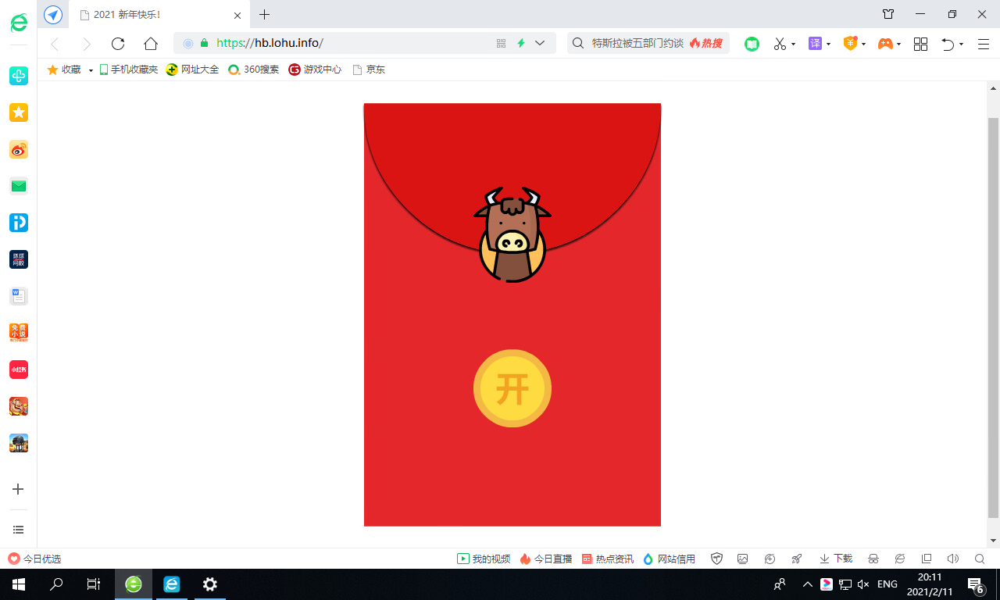

这里展示的是用 360 浏览器 + Flash 29.0.0.140 的组合来截的图，后面的内容就用的是 Flash 的[独立播放器](https://www.adobe.com/support/flashplayer/debug_downloads.html)来截图了。在 Flash 加载失败的页面上，我也介绍了可以使用 Flash 的独立播放器并下载 SWF 打开。

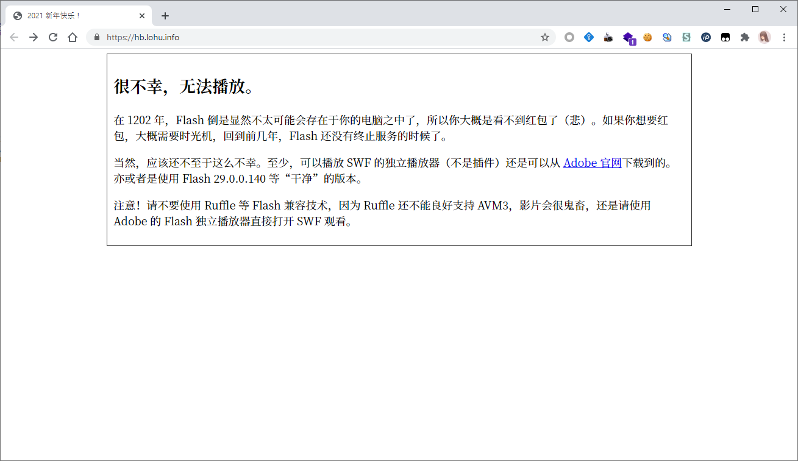

点击“开”之后，会显示一个手绘的 UI 界面，让我们输入八位口令。

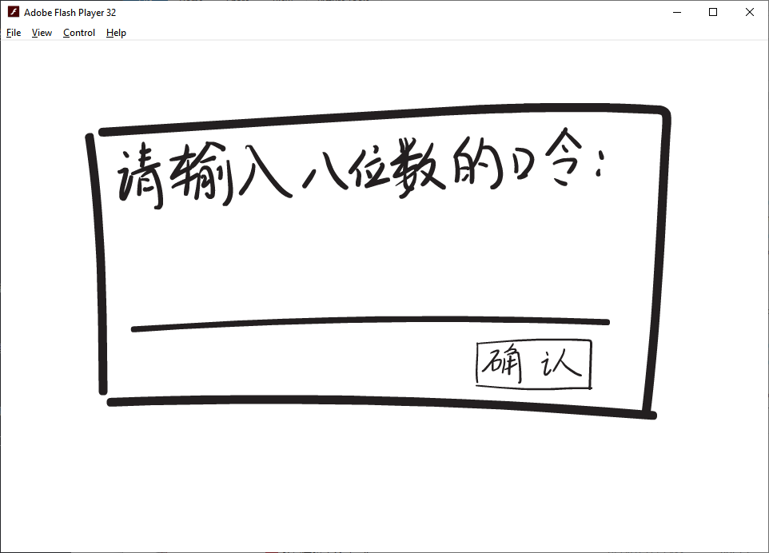

既然是八位，显然这里就是其中一个红包口令了。这道题目的本意就是逆向这个 SWF。逆向也十分简单，直接使用 JPEXS Free Flash Decompiler 打开这个 SWF 就可以了。打开以后可以注意到这里就是判断是否八位数正确的。而且说是“MD5.hash”之后进行比对，那么我们可以很容易地想到去爆破所有八位数字的组合，但是你会发现，完！全！爆！破！不！出！来！

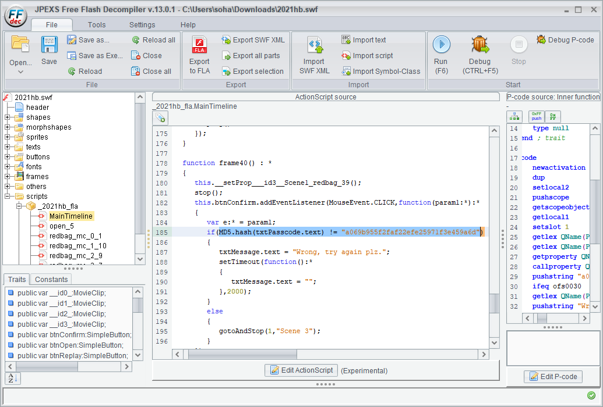

其实我在 MD5 类里面下了毒，本意是为了让大家审计代码，因为确实不长。当拿着那一串 hex 字符串而爆破不出来的时候，我觉得应该想到代码里有毒。因为不可能自己改 MD5 算法，毕竟自己改的东西没有经过算法验证，而且改了也就不叫 MD5 了，那么就可以排除掉 MD5 类里面和 MD5 计算有关的代码。

打开“dev.soha.hb2021.MD5”，仔细看就可以发现 toHex 方法里面，hexChars 被重新排序了，其实相当于每一个字节都异或上一个 0x88。所以 T+4h 的时候，我觉得不对劲就直接给出了一针见血的提示。还好有一个名为 Gogo 的朋友是在我发提示之前自己发现问题，并领取了红包，让我的心里有了点安慰。

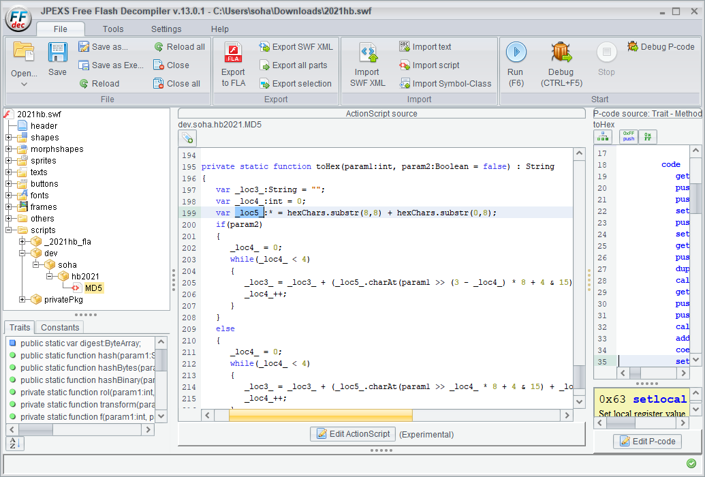

于是我们把代码中得到的“a069b955f2faf22efe25971f3e459a6d”每一个字节都 xor 0x88，就可以得到“28e131dd7a727aa676ad1f97b6cd12e5”。将其丢进随便一个 md5 查询网站，都能得到红包口令“61909386”。输入即可领取到一个红包。同时将这个代码输入刚才的“UI 界面”，就会跳转到新的一个场景，而反编译之后，我们也可以知道连续点击十次就能跳转到下一个场景。

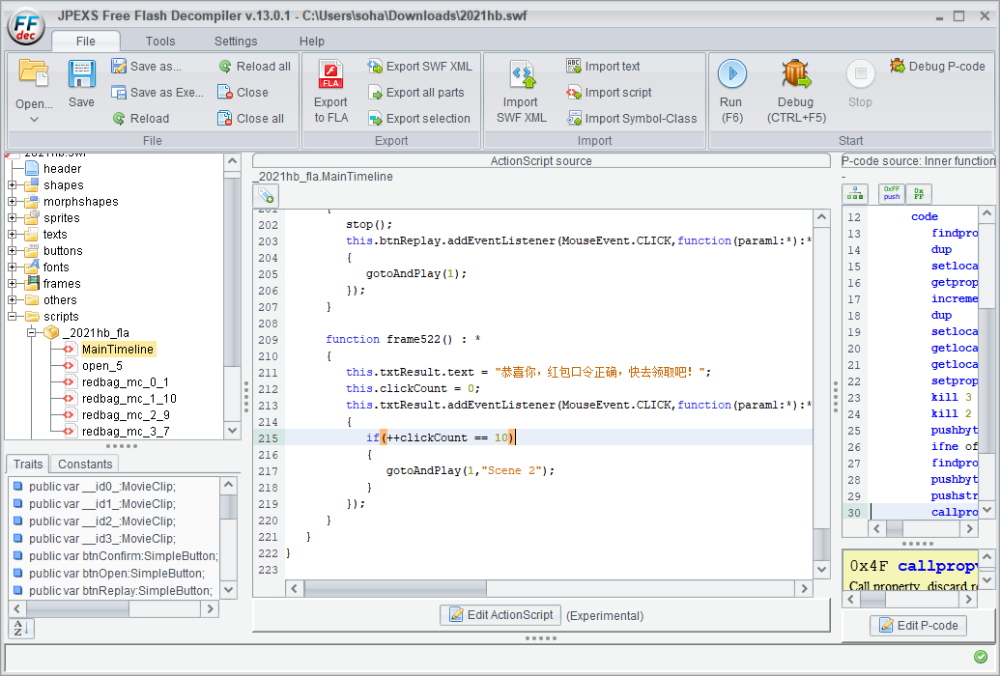

这个场景用几幅儿童手绘画（我也只能画出这个水平，也许还不如儿童orz）介绍了拿到第二个红包的方法。


注意这里面讲的，“港口 179”就是 179 号端口，查询可知这个端口是 BGP 协议使用的。“你是 7642，对面是 6674”的意思是 7642 是我们的 ASN，6674 是对面的 ASN。

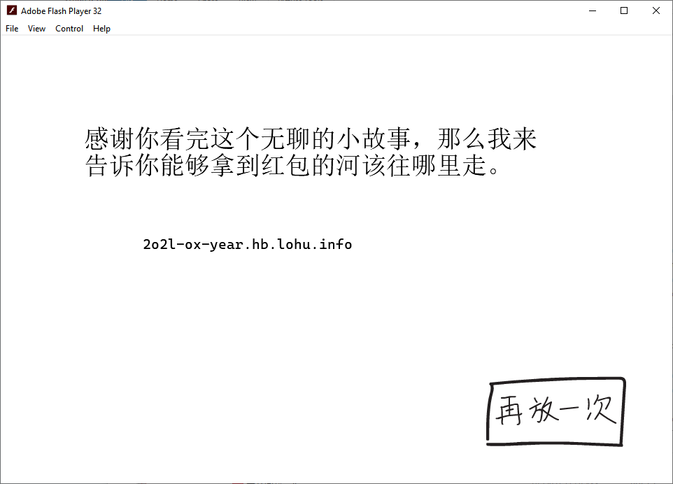

那么最后展示的这个地址“2o2l-ox-year.hb.lohu.info”解析出来的 IPv6 地址就是对端的地址。本来这个 IP 本来想用自己宣告的，但是一想国内 v6 出国的质量太差了，就开了台国内的腾讯云。

想要的东西都全了，那么接下来就是建立 BGP 连接。因为我自己的 AS209306 是 BIRD，所以这里使用的也是 BIRD 这个工具。从系统的源里面装好 bird2 之后，就像下面这样写配置文件就可以了。关于 BIRD 的配置文件怎么写，我在某篇博文上也有简单介绍。

```
ipv6 table hongbao;
protocol bgp hb {
	multihop;
	local as 7642;
	neighbor 2402:4e00:1400:590d:0:92b4:1829:8e55 as 6674;
	ipv6 {
		table hongbao;
		import all;
		export none;
	};
}
```

连接建立成功后就会收到 8 条路由，这一看就是把什么神秘的信息藏在了里面，我们把这些 hex 抠出来，使用 GBK 解析就能得到一些中文字了。

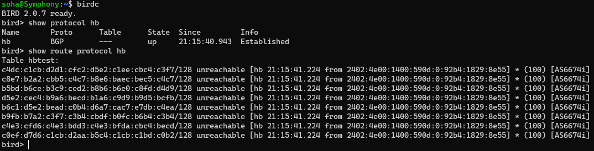

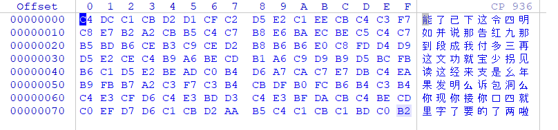

因为路由发送时候的顺序是没法固定的，所以我专门用一行八个字来写这些内容，就是为了能够一下子看出来其中的顺序。我们将第一个竖行的字排列成“如果你能读到这里”，那么接下来的所有内容都会排列好了，就像下面这样。

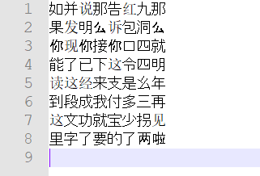

八位红包口令“90441372”也就出现在上面了。

以上就是今年红包的官方解法。

另外还有一个“彩蛋红包”，就出现在 HTTP 响应头里面，将其转换成十进制就可以了。

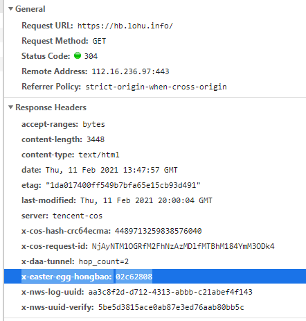
